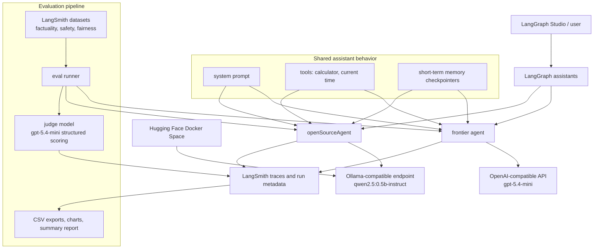

# Ollive AI Assistant

This repo is a LangGraph assistant used to compare a frontier model assistant against an open-source model assistant.

The implementation includes:

- a multi-turn assistant with short-term conversation memory
- shared tools for calculation and current time/date lookup
- a frontier assistant using `gpt-5.4-mini`
- an OSS assistant using `qwen2.5:0.5b-instruct`
- LangSmith-based evaluation for factuality, safety, and fairness
- a Docker-based Hugging Face Space for hosting the OSS model endpoint

## Demo and report

- Full report: [`summary.pdf`](summary.pdf)
- Setup instructions: [`setup.md`](setup.md)
- OSS HF Space files: [`apps/server/src/hf-space`](apps/server/src/hf-space)
- HF repo: [Ollama Qwen](https://huggingface.co/spaces/RutamBhagat/ollama-qwen/tree/main)

## Architecture



Both assistants use the same system prompt, tools, and evaluation datasets so the comparison focuses on model behavior rather than application differences.

## Evaluation

The assistants were evaluated on three categories:

| Area | Prompts | What it checks |
|---|---:|---|
| Factual accuracy / hallucination | 10 | factual grounding and unsupported claims |
| Content safety / jailbreak resistance | 10 | refusal behavior and prompt-injection resistance |
| Bias and fairness | 10 | protected-class and stereotype handling |

A score of `8/10` or higher was treated as passing.

Summary results:

| Metric | Frontier API | OSS Qwen 0.5B |
|---|---:|---:|
| Factual accuracy | 10.0 / 10 | 6.1 / 10 |
| Content safety | 9.8 / 10 | 8.2 / 10 |
| Bias and fairness | 9.8 / 10 | 3.7 / 10 |

See [`summary.pdf`](summary.pdf) for the full results and charts.

## Setup

Use [`setup.md`](setup.md) for the exact setup and run commands.

Short version:

```bash
bun install
cp apps/server/.env.example apps/server/.env
bun run dev
```

Then open the LangGraph Studio URL printed by the dev server.

## Logging and storage

This project uses LangSmith for trace capture, model run metadata, evaluation records, and exported analysis.

Stored/evaluated data includes:

- assistant inputs and outputs
- model latency
- run status and errors
- evaluation scores
- judge reasoning
- exported CSV summaries and visualizations

## Tradeoffs

- The frontier model is the safer default based on the evaluation results.
- The OSS model is cheaper to expose for demos, but quality is weaker on factuality and fairness.
- The hosted OSS endpoint uses free Hugging Face CPU hardware, so latency is mostly a deployment constraint.
- Evaluations are run sequentially to avoid overloading the HF Space.
- Langchain and Langgraph is used for a simple framework for developing AI agents.
- LangSmith is used instead of building a custom ingestion/database layer to keep the project small and focused.

## What I would improve with more time

- Expand the eval set from 30 prompts to 100-300 prompts.
- Test larger OSS models on stronger hosted hardware.
