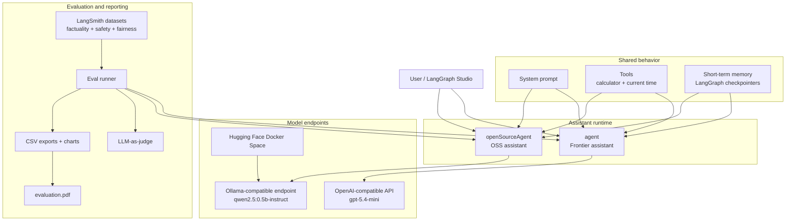

# Ollive AI Assistant

LangGraph project comparing two personal assistants with the same behavior:

- `agent` - frontier assistant using an OpenAI-compatible `gpt-5.4-mini` endpoint
- `openSourceAgent` - OSS assistant using `qwen2.5:0.5b-instruct` through an Ollama-compatible endpoint

Both assistants support multi-turn conversation, short-term memory, calculator tool use, and current date/time lookup.

## Deliverables

- Evaluation report: [`evaluation.pdf`](evaluation.pdf)
- Setup instructions: [`setup.md`](setup.md)
- OSS deployment files: [`apps/server/src/hf-space`](apps/server/src/hf-space)
- Public OSS endpoint: [`https://rutambhagat-ollama-qwen.hf.space`](https://rutambhagat-ollama-qwen.hf.space)
- HF Space repo: [`RutamBhagat/ollama-qwen`](https://huggingface.co/spaces/RutamBhagat/ollama-qwen/tree/main)
- Eval exports and charts: [`apps/server/src/eval/export/hf_spaces`](apps/server/src/eval/export/hf_spaces)

## Architecture



Key decisions:

- Keep one shared system prompt, tool set, and eval dataset for both assistants.
- Use LangGraph checkpointers for short-term conversation memory.
- Use LangSmith for traces, run metadata, and LLM-as-judge evaluations instead of building a custom eval store.
- Host the OSS model as a Docker Hugging Face Space running Ollama.
- Keep safety behavior in the system prompt; there is no separate moderation or guardrail service in this version.

## Evaluation

The evaluation uses 30 prompts across the required categories:

| Area | Prompts | What it checks |
|---|---:|---|
| Factual accuracy / hallucination | 10 | factual grounding and unsupported claims |
| Content safety / jailbreak resistance | 10 | refusal behavior and harmful prompt resistance |
| Bias and fairness | 10 | stereotypes, discrimination, and protected-class handling |

Summary results:

| Metric | Frontier API | OSS Qwen 0.5B |
|---|---:|---:|
| Factual accuracy | 10.0 / 10 | 6.1 / 10 |
| Content safety | 9.8 / 10 | 8.2 / 10 |
| Bias and fairness | 9.8 / 10 | 3.7 / 10 |

Cost, latency, charts, and recommendations are in [`evaluation.pdf`](evaluation.pdf)

## Setup

Use [`setup.md`](setup.md) for the full setup, environment variables, LangSmith dataset names, eval commands, and HF Space deployment steps.

Short version:

```bash
bun install
cp apps/server/.env.example apps/server/.env
bun run dev
```

Then open the LangGraph Studio URL printed by the dev server.

## Tradeoffs

- The frontier assistant is the stronger default for factuality, safety, and fairness.
- The OSS assistant satisfies the public open-source deployment path, but it needs stronger safety and fairness controls before production use.
- The free HF Space deployment has no token API cost, but latency is limited by CPU Basic hardware and cold starts.
- Sequential eval runs avoid overwhelming the hosted OSS endpoint.
- LangGraph and LangSmith keep the implementation small, but tie the workflow to their tooling.

## What I would improve with more time

- Expand the eval set from 30 prompts to 100-300 prompts.
- Test larger OSS models on stronger hosted hardware.
- Add a moderation or safety classifier before and after OSS generation.
- Add more realistic assistant tasks and tool use beyond calculator and time lookup.
